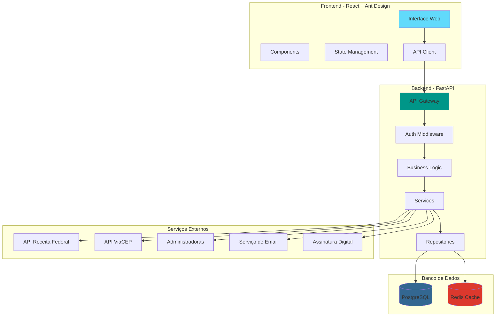

# Especificações Técnicas - Sistema CRM de Consórcios

## Arquitetura do Sistema



## Estrutura de Pastas Completa

### Backend (FastAPI)

```
backend/
├── app/
│   ├── __init__.py
│   ├── main.py                          # Aplicação principal
│   ├── config.py                        # Configurações
│   ├── dependencies.py                  # Dependências comuns
│   │
│   ├── api/
│   │   └── v1/
│   │       ├── __init__.py
│   │       ├── router.py                # Router principal
│   │       └── endpoints/
│   │           ├── __init__.py
│   │           ├── auth.py              # Login, logout, refresh
│   │           ├── usuarios.py          # CRUD usuários
│   │           ├── clientes.py          # CRUD clientes
│   │           ├── beneficios.py        # CRUD benefícios
│   │           ├── contratos.py         # Gerar contratos
│   │           ├── termos_adesao.py     # Gerar termos
│   │           ├── relatorios.py        # Relatórios PDF
│   │           ├── unidades.py          # CRUD unidades
│   │           ├── empresas.py          # CRUD empresas
│   │           ├── representantes.py    # CRUD representantes
│   │           ├── consultores.py       # CRUD consultores
│   │           ├── administradoras.py   # CRUD administradoras
│   │           ├── tabela_credito.py    # Tabelas de crédito
│   │           ├── agendamentos.py      # CRUD agendamentos
│   │           └── dashboard.py         # Métricas e KPIs
│   │
│   ├── models/
│   │   ├── __init__.py
│   │   ├── base.py                      # Base model
│   │   ├── usuario.py
│   │   ├── cliente.py
│   │   ├── compromisso_financeiro.py
│   │   ├── dados_profissionais.py
│   │   ├── preferencia_cliente.py
│   │   ├── dados_bancarios.py
│   │   ├── beneficio.py
│   │   ├── contrato.py
│   │   ├── termo_adesao.py
│   │   ├── assinatura.py
│   │   ├── tabela_credito.py
│   │   ├── unidade.py
│   │   ├── empresa.py
│   │   ├── representante.py
│   │   ├── consultor.py
│   │   ├── administradora.py
│   │   ├── agendamento.py
│   │   ├── documento.py
│   │   └── auditoria.py
│   │
│   ├── schemas/
│   │   ├── __init__.py
│   │   ├── usuario.py
│   │   ├── cliente.py
│   │   ├── beneficio.py
│   │   ├── contrato.py
│   │   ├── termo_adesao.py
│   │   ├── relatorio.py
│   │   └── ... (schemas para cada model)
│   │
│   ├── services/
│   │   ├── __init__.py
│   │   ├── auth_service.py              # Autenticação
│   │   ├── cliente_service.py           # Lógica de clientes
│   │   ├── beneficio_service.py         # Lógica de benefícios
│   │   ├── contrato_service.py          # Geração de contratos
│   │   ├── termo_adesao_service.py      # Geração de termos
│   │   ├── pdf_service.py               # Geração de PDFs
│   │   ├── email_service.py             # Envio de emails
│   │   ├── assinatura_service.py        # Validação de assinaturas
│   │   ├── administradora_service.py    # Integração com administradoras
│   │   ├── validacao_service.py         # Validações CPF, CNPJ
│   │   └── calculo_service.py           # Cálculos financeiros
│   │
│   ├── repositories/
│   │   ├── __init__.py
│   │   ├── base_repository.py           # Repository pattern base
│   │   ├── cliente_repository.py
│   │   ├── beneficio_repository.py
│   │   ├── contrato_repository.py
│   │   └── ... (repository para cada entidade)
│   │
│   ├── core/
│   │   ├── __init__.py
│   │   ├── database.py                  # Conexão DB
│   │   ├── redis.py                     # Conexão Redis
│   │   ├── security.py                  # JWT, hashing
│   │   ├── exceptions.py                # Exceções customizadas
│   │   ├── logger.py                    # Configuração de logs
│   │   └── config.py                    # Settings
│   │
│   ├── utils/
│   │   ├── __init__.py
│   │   ├── validators.py                # Validadores CPF, CNPJ, etc
│   │   ├── formatters.py                # Formatação de dados
│   │   ├── cep_api.py                   # Integração ViaCEP
│   │   ├── receita_federal_api.py       # Validação CPF
│   │   ├── pdf_templates.py             # Templates de PDF
│   │   ├── email_templates.py           # Templates de email
│   │   └── helpers.py                   # Funções auxiliares
│   │
│   └── templates/
│       ├── relatorio_explicativo.html
│       ├── contrato_oficial.html
│       └── termo_adesao.html
│
├── alembic/
│   ├── versions/                        # Migrations
│   ├── env.py
│   └── script.py.mako
│
├── tests/
│   ├── __init__.py
│   ├── conftest.py
│   ├── unit/
│   │   ├── test_services.py
│   │   └── test_validators.py
│   └── integration/
│       ├── test_api_clientes.py
│       ├── test_api_beneficios.py
│       └── test_api_auth.py
│
├── scripts/
│   ├── seed_data.py                     # Popular banco com dados
│   ├── create_admin.py                  # Criar usuário admin
│   └── backup_db.sh                     # Script de backup
│
├── .env.example
├── .gitignore
├── alembic.ini
├── docker-compose.yml
├── Dockerfile
├── requirements.txt
└── README.md
```

### Frontend (React + Ant Design)

```
frontend/
├── public/
│   ├── index.html
│   ├── favicon.ico
│   └── logo.png
│
├── src/
│   ├── App.jsx                          # Componente principal
│   ├── main.jsx                         # Entry point
│   │
│   ├── api/
│   │   ├── axiosConfig.js               # Configuração Axios
│   │   ├── authApi.js                   # Endpoints de autenticação
│   │   ├── clienteApi.js                # Endpoints de clientes
│   │   ├── beneficioApi.js              # Endpoints de benefícios
│   │   ├── contratoApi.js               # Endpoints de contratos
│   │   ├── relatorioApi.js              # Endpoints de relatórios
│   │   └── ... (api para cada recurso)
│   │
│   ├── components/
│   │   ├── common/
│   │   │   ├── Layout.jsx               # Layout principal
│   │   │   ├── Header.jsx               # Cabeçalho
│   │   │   ├── Sidebar.jsx              # Menu lateral
│   │   │   ├── Loading.jsx              # Indicador de loading
│   │   │   ├── ErrorBoundary.jsx        # Tratamento de erros
│   │   │   ├── PrivateRoute.jsx         # Rota protegida
│   │   │   └── ConfirmModal.jsx         # Modal de confirmação
│   │   │
│   │   ├── forms/
│   │   │   ├── ClienteForm/
│   │   │   │   ├── index.jsx            # Formulário principal
│   │   │   │   ├── DadosBasicos.jsx     # Seção dados básicos
│   │   │   │   ├── CompromissosFinanceiros.jsx
│   │   │   │   ├── DadosProfissionais.jsx
│   │   │   │   ├── PreferenciasCliente.jsx
│   │   │   │   └── DadosBancarios.jsx
│   │   │   │
│   │   │   ├── BeneficioForm/
│   │   │   │   ├── index.jsx
│   │   │   │   ├── DadosBeneficio.jsx
│   │   │   │   └── SimuladorParcela.jsx
│   │   │   │
│   │   │   └── inputs/
│   │   │       ├── CPFInput.jsx         # Input com máscara CPF
│   │   │       ├── PhoneInput.jsx       # Input com máscara telefone
│   │   │       ├── CEPInput.jsx         # Input com busca de CEP
│   │   │       ├── MoneyInput.jsx       # Input formatado moeda
│   │   │       └── DateInput.jsx        # Input de data
│   │   │
│   │   ├── tables/
│   │   │   ├── ClienteTable.jsx
│   │   │   ├── BeneficioTable.jsx
│   │   │   └── AgendamentoTable.jsx
│   │   │
│   │   └── cards/
│   │       ├── ClienteCard.jsx
│   │       ├── BeneficioCard.jsx
│   │       └── StatCard.jsx
│   │
│   ├── pages/
│   │   ├── Login/
│   │   │   └── index.jsx
│   │   │
│   │   ├── Dashboard/
│   │   │   ├── index.jsx
│   │   │   └── components/
│   │   │       ├── MetricasVendas.jsx
│   │   │       ├── PipelineChart.jsx
│   │   │       └── AtividadesRecentes.jsx
│   │   │
│   │   ├── Clientes/
│   │   │   ├── List.jsx                 # Lista de clientes
│   │   │   ├── Create.jsx               # Criar cliente
│   │   │   ├── Edit.jsx                 # Editar cliente
│   │   │   └── View.jsx                 # Visualizar cliente
│   │   │
│   │   ├── Beneficios/
│   │   │   ├── List.jsx
│   │   │   ├── Create.jsx
│   │   │   ├── Edit.jsx
│   │   │   └── View.jsx
│   │   │
│   │   ├── Contratos/
│   │   │   ├── List.jsx
│   │   │   ├── Preview.jsx              # Preview do contrato
│   │   │   └── Assinatura.jsx           # Tela de assinatura
│   │   │
│   │   ├── TermosAdesao/
│   │   │   ├── List.jsx
│   │   │   ├── Preview.jsx
│   │   │   └── AssinaturaDigital.jsx
│   │   │
│   │   ├── Relatorios/
│   │   │   ├── index.jsx
│   │   │   ├── RelatorioExplicativo.jsx
│   │   │   └── RelatoriosGerenciais.jsx
│   │   │
│   │   ├── Agendamentos/
│   │   │   ├── List.jsx
│   │   │   ├── Calendar.jsx             # Calendário de agendamentos
│   │   │   └── Create.jsx
│   │   │
│   │   └── Configuracoes/
│   │       ├── Unidades/
│   │       ├── Empresas/
│   │       ├── Representantes/
│   │       ├── TabelasCredito/
│   │       └── Perfil/
│   │
│   ├── hooks/
│   │   ├── useAuth.js                   # Hook de autenticação
│   │   ├── useCliente.js                # Hook de clientes
│   │   ├── useBeneficio.js              # Hook de benefícios
│   │   ├── useDebounce.js               # Hook de debounce
│   │   └── usePagination.js             # Hook de paginação
│   │
│   ├── contexts/
│   │   ├── AuthContext.jsx              # Contexto de autenticação
│   │   └── NotificationContext.jsx      # Contexto de notificações
│   │
│   ├── routes/
│   │   └── index.jsx                    # Configuração de rotas
│   │
│   ├── utils/
│   │   ├── validators.js                # Validadores
│   │   ├── formatters.js                # Formatadores
│   │   ├── constants.js                 # Constantes
│   │   ├── helpers.js                   # Funções auxiliares
│   │   └── storage.js                   # Local/Session Storage
│   │
│   ├── styles/
│   │   ├── global.css                   # Estilos globais
│   │   ├── variables.css                # Variáveis CSS
│   │   └── antd-custom.css              # Customização Ant Design
│   │
│   └── assets/
│       ├── images/
│       └── icons/
│
├── .env.example
├── .gitignore
├── package.json
├── vite.config.js
└── README.md
```

## API Endpoints Principais

### Autenticação

```
POST   /api/v1/auth/login              # Login
POST   /api/v1/auth/logout             # Logout
POST   /api/v1/auth/refresh            # Refresh token
POST   /api/v1/auth/forgot-password    # Esqueci senha
POST   /api/v1/auth/reset-password     # Resetar senha
GET    /api/v1/auth/me                 # Dados do usuário logado
```

### Clientes

```
GET    /api/v1/clientes                # Listar (paginado, filtros)
POST   /api/v1/clientes                # Criar
GET    /api/v1/clientes/{id}           # Buscar por ID
PUT    /api/v1/clientes/{id}           # Atualizar
DELETE /api/v1/clientes/{id}           # Deletar (soft delete)
GET    /api/v1/clientes/{id}/resumo    # Resumo completo
POST   /api/v1/clientes/validar-cpf    # Validar CPF na Receita
```

### Benefícios

```
GET    /api/v1/beneficios              # Listar
POST   /api/v1/beneficios              # Criar
GET    /api/v1/beneficios/{id}         # Buscar por ID
PUT    /api/v1/beneficios/{id}         # Atualizar
DELETE /api/v1/beneficios/{id}         # Deletar
POST   /api/v1/beneficios/{id}/propor  # Marcar como proposto
POST   /api/v1/beneficios/{id}/aceitar # Cliente aceita
POST   /api/v1/beneficios/{id}/rejeitar # Cliente rejeita
GET    /api/v1/beneficios/cliente/{cliente_id} # Benefícios do cliente
```

### Contratos

```
POST   /api/v1/contratos/gerar         # Gerar contrato de benefício
GET    /api/v1/contratos/{id}          # Buscar contrato
GET    /api/v1/contratos/{id}/pdf      # Download PDF
POST   /api/v1/contratos/{id}/assinar  # Registrar assinatura
GET    /api/v1/contratos/beneficio/{beneficio_id} # Contrato do benefício
```

### Termos de Adesão

```
POST   /api/v1/termos-adesao/gerar     # Gerar termo
GET    /api/v1/termos-adesao/{id}      # Buscar termo
GET    /api/v1/termos-adesao/{id}/pdf  # Download PDF
POST   /api/v1/termos-adesao/{id}/assinar-digitalmente # Assinatura digital
```

### Relatórios

```
POST   /api/v1/relatorios/explicativo  # Gerar relatório explicativo
POST   /api/v1/relatorios/cliente-completo # Relatório completo cliente
POST   /api/v1/relatorios/vendas       # Relatório de vendas
POST   /api/v1/relatorios/pipeline     # Relatório de pipeline
GET    /api/v1/relatorios/{id}/download # Download do relatório
```

### Administradoras

```
POST   /api/v1/administradoras/cadastrar-beneficio # Cadastrar na administradora
GET    /api/v1/administradoras/{id}/status/{beneficio_id} # Verificar status
PUT    /api/v1/administradoras/atualizar-grupo-cota # Atualizar grupo/cota
```

### Tabelas de Crédito

```
GET    /api/v1/tabelas-credito         # Listar tabelas
POST   /api/v1/tabelas-credito/simular # Simular parcela
GET    /api/v1/tabelas-credito/opcoes  # Opções por tipo de bem
```

### Dashboard

```
GET    /api/v1/dashboard/metricas      # Métricas principais
GET    /api/v1/dashboard/pipeline      # Pipeline de vendas
GET    /api/v1/dashboard/atividades    # Atividades recentes
```

## Schemas de Dados (Pydantic)

### Schema de Cliente (Request)

```python
from pydantic import BaseModel, EmailStr, Field, validator
from datetime import date, datetime
from typing import Optional, List
from uuid import UUID

class ClienteCreate(BaseModel):
    # Dados Básicos
    natureza: str = Field(..., regex="^(Física|Jurídica)$")
    unidade_id: UUID
    empresa_id: Optional[UUID]
    nome: str = Field(..., min_length=3, max_length=255)
    cpf: str = Field(..., regex=r"^\d{3}\.\d{3}\.\d{3}-\d{2}$")
    identidade: Optional[str]
    orgao_expedidor: Optional[str]
    data_expedicao: Optional[date]
    sexo: Optional[str] = Field(None, regex="^(Feminino|Masculino|Outro)$")
    data_nascimento: date
    nacionalidade: Optional[str]
    naturalidade: Optional[str]
    nome_mae: Optional[str]
    nome_pai: Optional[str]
    estado_civil: Optional[str]
    
    # Cônjuge
    conjuge_nome: Optional[str]
    conjuge_data_nascimento: Optional[date]
    conjuge_cpf: Optional[str]
    
    # Contato
    telefone: str
    endereco: Optional[str]
    email: Optional[EmailStr]
    
    # Observações
    observacoes: Optional[str]
    
    # Relacionados
    compromissos_financeiros: List['CompromissoFinanceiroCreate']
    dados_profissionais: Optional['DadosProfissionaisCreate']
    preferencias: Optional['PreferenciaClienteCreate']
    dados_bancarios: Optional['DadosBancariosCreate']
    
    @validator('cpf')
    def validar_cpf(cls, v):
        from app.utils.validators import validar_cpf
        if not validar_cpf(v):
            raise ValueError('CPF inválido')
        return v

class CompromissoFinanceiroCreate(BaseModel):
    tipo: str
    possui: bool
    prazo: Optional[int]
    valor: Optional[float]

class DadosProfissionaisCreate(BaseModel):
    empresa: Optional[str]
    cargo: Optional[str]
    salario: Optional[float]

class PreferenciaClienteCreate(BaseModel):
    parcela_maxima: Optional[float]
    valor_carta: Optional[float]
    taxa_inicial: Optional[float]

class DadosBancariosCreate(BaseModel):
    banco: Optional[str]
    chave_pix: Optional[str]
    tipo_conta: Optional[str]
    agencia: Optional[str]
    conta: Optional[str]
```

### Schema de Benefício

```python
class BeneficioCreate(BaseModel):
    cliente_id: UUID
    representante_id: UUID
    consultor_id: Optional[UUID]
    empresa_id: Optional[UUID]
    unidade_id: UUID
    
    prazo_grupo: int = Field(..., ge=12, le=240)
    valor_credito: float = Field(..., gt=0)
    parcela: float = Field(..., gt=0)
    indice_correcao: str = "INCC"
    fundo_reserva: float = Field(..., ge=0)
    seguro_prestamista: float = Field(default=0.00, ge=0, le=100)
    taxa_adm_total: float = Field(default=26.00, ge=0, le=100)
    valor_demais_parcelas: Optional[float]
    
    tipo_bem: str = Field(..., regex="^(Imóvel|Carro|Moto)$")
    qtd_participantes: int = Field(default=4076)
    tipo_plano: str = Field(default="Normal")
    
    @validator('parcela')
    def validar_parcela_capacidade(cls, v, values):
        # Validar se parcela não excede capacidade do cliente
        # Buscar dados do cliente e validar
        return v

class BeneficioResponse(BaseModel):
    id: UUID
    cliente_id: UUID
    status: str
    prazo_grupo: int
    valor_credito: float
    parcela: float
    tipo_bem: str
    grupo: Optional[str]
    cota: Optional[str]
    created_at: datetime
    updated_at: datetime
    
    class Config:
        from_attributes = True
```

## Services - Lógica de Negócio

### Exemplo: BeneficioService

```python
from typing import List, Optional
from uuid import UUID
from sqlalchemy.orm import Session
from app.models.beneficio import Beneficio
from app.schemas.beneficio import BeneficioCreate
from app.repositories.beneficio_repository import BeneficioRepository
from app.services.calculo_service import CalculoService
from app.core.exceptions import BusinessException

class BeneficioService:
    def __init__(self, db: Session):
        self.db = db
        self.repository = BeneficioRepository(db)
        self.calculo_service = CalculoService()
    
    async def criar_beneficio(
        self, 
        beneficio_data: BeneficioCreate,
        usuario_id: UUID
    ) -> Beneficio:
        """
        Cria um novo benefício após validações
        """
        # 1. Validar cliente existe
        cliente = await self._validar_cliente(beneficio_data.cliente_id)
        
        # 2. Validar capacidade de pagamento
        await self._validar_capacidade_pagamento(
            cliente, 
            beneficio_data.parcela
        )
        
        # 3. Calcular valores baseado na tabela de crédito
        valores_calculados = await self.calculo_service.calcular_beneficio(
            prazo=beneficio_data.prazo_grupo,
            valor_credito=beneficio_data.valor_credito,
            tipo_bem=beneficio_data.tipo_bem
        )
        
        # 4. Criar benefício
        beneficio = await self.repository.create(beneficio_data)
        
        # 5. Registrar auditoria
        await self._registrar_auditoria(
            acao="CRIAR_BENEFICIO",
            beneficio_id=beneficio.id,
            usuario_id=usuario_id
        )
        
        return beneficio
    
    async def propor_beneficio(
        self, 
        beneficio_id: UUID,
        usuario_id: UUID
    ) -> Beneficio:
        """
        Marca benefício como proposto e gera relatório
        """
        beneficio = await self.repository.get_by_id(beneficio_id)
        
        if beneficio.status != "Rascunho":
            raise BusinessException("Benefício não está em rascunho")
        
        # Atualizar status
        beneficio.status = "Proposto"
        await self.repository.update(beneficio)
        
        # Gerar relatório explicativo
        from app.services.relatorio_service import RelatorioService
        relatorio_service = RelatorioService(self.db)
        await relatorio_service.gerar_relatorio_explicativo(beneficio_id)
        
        # Enviar email para cliente
        from app.services.email_service import EmailService
        email_service = EmailService()
        await email_service.enviar_proposta_beneficio(beneficio)
        
        return beneficio
    
    async def cadastrar_na_administradora(
        self,
        beneficio_id: UUID,
        administradora_id: UUID,
        usuario_id: UUID
    ) -> Beneficio:
        """
        Cadastra benefício na administradora
        """
        beneficio = await self.repository.get_by_id(beneficio_id)
        
        if beneficio.status != "Contrato Assinado":
            raise BusinessException(
                "Contrato deve estar assinado para cadastrar na administradora"
            )
        
        # Chamar API da administradora
        from app.services.administradora_service import AdministradoraService
        admin_service = AdministradoraService(self.db)
        
        resultado = await admin_service.cadastrar_beneficio(
            beneficio=beneficio,
            administradora_id=administradora_id
        )
        
        if resultado.sucesso:
            # Atualizar benefício com grupo e cota
            beneficio.grupo = resultado.grupo
            beneficio.cota = resultado.cota
            beneficio.status = "Cadastrado"
            beneficio.administradora_id = administradora_id
            beneficio.data_cadastro_administradora = datetime.now()
            
            await self.repository.update(beneficio)
        
        return beneficio
```

## Componentes React Principais

### ClienteForm - Formulário de Cliente

```jsx
import React, { useState } from 'react';
import { Form, Tabs, Button, message } from 'antd';
import DadosBasicos from './DadosBasicos';
import CompromissosFinanceiros from './CompromissosFinanceiros';
import DadosProfissionais from './DadosProfissionais';
import PreferenciasCliente from './PreferenciasCliente';
import DadosBancarios from './DadosBancarios';
import { clienteApi } from '@/api/clienteApi';

const ClienteForm = ({ clienteId, onSuccess }) => {
  const [form] = Form.useForm();
  const [loading, setLoading] = useState(false);
  const [activeTab, setActiveTab] = useState('1');

  const handleSubmit = async (values) => {
    setLoading(true);
    try {
      if (clienteId) {
        await clienteApi.update(clienteId, values);
        message.success('Cliente atualizado com sucesso!');
      } else {
        await clienteApi.create(values);
        message.success('Cliente cadastrado com sucesso!');
      }
      onSuccess?.();
    } catch (error) {
      message.error('Erro ao salvar cliente: ' + error.message);
    } finally {
      setLoading(false);
    }
  };

  const tabs = [
    {
      key: '1',
      label: 'Dados Básicos',
      children: <DadosBasicos form={form} />
    },
    {
      key: '2',
      label: 'Compromissos Financeiros',
      children: <CompromissosFinanceiros form={form} />
    },
    {
      key: '3',
      label: 'Dados Profissionais',
      children: <DadosProfissionais form={form} />
    },
    {
      key: '4',
      label: 'Preferências',
      children: <PreferenciasCliente form={form} />
    },
    {
      key: '5',
      label: 'Dados Bancários',
      children: <DadosBancarios form={form} />
    }
  ];

  return (
    <Form
      form={form}
      layout="vertical"
      onFinish={handleSubmit}
    >
      <Tabs
        activeKey={activeTab}
        onChange={setActiveTab}
        items={tabs}
      />

      <div style={{ marginTop: 24, textAlign: 'right' }}>
        <Button
          type="primary"
          htmlType="submit"
          loading={loading}
          size="large"
        >
          {clienteId ? 'Atualizar' : 'Cadastrar'}
        </Button>
      </div>
    </Form>
  );
};

export default ClienteForm;
```

### DadosBasicos Component

```jsx
import React from 'react';
import { Form, Input, Select, DatePicker, Row, Col, Button } from 'antd';
import { CPFInput, CEPInput, PhoneInput } from '@/components/forms/inputs';
import { validarCPF } from '@/utils/validators';
import { clienteApi } from '@/api/clienteApi';

const DadosBasicos = ({ form }) => {
  const handleValidarCPF = async () => {
    const cpf = form.getFieldValue('cpf');
    if (!cpf) return;
    
    try {
      const resultado = await clienteApi.validarCPF(cpf);
      if (resultado.valido) {
        message.success('CPF válido!');
        // Preencher dados se disponíveis da Receita
        if (resultado.dados) {
          form.setFieldsValue({
            nome: resultado.dados.nome,
            // outros campos...
          });
        }
      } else {
        message.error('CPF inválido!');
      }
    } catch (error) {
      message.error('Erro ao validar CPF');
    }
  };

  return (
    <>
      <Row gutter={16}>
        <Col span={12}>
          <Form.Item
            name="nome"
            label="Nome Completo"
            rules={[{ required: true, message: 'Campo obrigatório' }]}
          >
            <Input placeholder="Digite o nome completo" />
          </Form.Item>
        </Col>
        
        <Col span={12}>
          <Form.Item
            name="cpf"
            label="CPF"
            rules={[
              { required: true, message: 'Campo obrigatório' },
              { validator: validarCPF }
            ]}
          >
            <CPFInput 
              placeholder="000.000.000-00"
              addonAfter={
                <Button size="small" onClick={handleValidarCPF}>
                  Validar
                </Button>
              }
            />
          </Form.Item>
        </Col>
      </Row>

      <Row gutter={16}>
        <Col span={8}>
          <Form.Item
            name="data_nascimento"
            label="Data de Nascimento"
            rules={[{ required: true }]}
          >
            <DatePicker 
              format="DD/MM/YYYY"
              style={{ width: '100%' }}
              placeholder="DD/MM/AAAA"
            />
          </Form.Item>
        </Col>
        
        <Col span={8}>
          <Form.Item
            name="sexo"
            label="Sexo"
            rules={[{ required: true }]}
          >
            <Select placeholder="Selecione">
              <Select.Option value="Feminino">Feminino</Select.Option>
              <Select.Option value="Masculino">Masculino</Select.Option>
              <Select.Option value="Outro">Outro</Select.Option>
            </Select>
          </Form.Item>
        </Col>
        
        <Col span={8}>
          <Form.Item
            name="estado_civil"
            label="Estado Civil"
          >
            <Select placeholder="Selecione">
              <Select.Option value="Solteiro">Solteiro(a)</Select.Option>
              <Select.Option value="Casado">Casado(a)</Select.Option>
              <Select.Option value="União Estável">União Estável</Select.Option>
              <Select.Option value="Divorciado">Divorciado(a)</Select.Option>
              <Select.Option value="Viúvo">Viúvo(a)</Select.Option>
            </Select>
          </Form.Item>
        </Col>
      </Row>

      <Row gutter={16}>
        <Col span={12}>
          <Form.Item
            name="telefone"
            label="Telefone"
            rules={[{ required: true }]}
          >
            <PhoneInput placeholder="(00) 00000-0000" />
          </Form.Item>
        </Col>
        
        <Col span={12}>
          <Form.Item
            name="email"
            label="E-mail"
            rules={[{ type: 'email', message: 'E-mail inválido' }]}
          >
            <Input placeholder="email@exemplo.com" />
          </Form.Item>
        </Col>
      </Row>

      {/* Mais campos... */}
    </>
  );
};

export default DadosBasicos;
```

## Configurações de Segurança

### JWT Configuration

```python
# app/core/security.py
from datetime import datetime, timedelta
from typing import Optional
from jose import JWTError, jwt
from passlib.context import CryptContext

SECRET_KEY = "your-secret-key-here-change-in-production"
ALGORITHM = "HS256"
ACCESS_TOKEN_EXPIRE_MINUTES = 30
REFRESH_TOKEN_EXPIRE_DAYS = 7

pwd_context = CryptContext(schemes=["bcrypt"], deprecated="auto")

def create_access_token(data: dict, expires_delta: Optional[timedelta] = None):
    to_encode = data.copy()
    if expires_delta:
        expire = datetime.utcnow() + expires_delta
    else:
        expire = datetime.utcnow() + timedelta(minutes=ACCESS_TOKEN_EXPIRE_MINUTES)
    
    to_encode.update({"exp": expire, "type": "access"})
    encoded_jwt = jwt.encode(to_encode, SECRET_KEY, algorithm=ALGORITHM)
    return encoded_jwt

def create_refresh_token(data: dict):
    to_encode = data.copy()
    expire = datetime.utcnow() + timedelta(days=REFRESH_TOKEN_EXPIRE_DAYS)
    to_encode.update({"exp": expire, "type": "refresh"})
    encoded_jwt = jwt.encode(to_encode, SECRET_KEY, algorithm=ALGORITHM)
    return encoded_jwt

def verify_password(plain_password: str, hashed_password: str) -> bool:
    return pwd_context.verify(plain_password, hashed_password)

def get_password_hash(password: str) -> str:
    return pwd_context.hash(password)
```

### CORS Configuration

```python
# app/main.py
from fastapi import FastAPI
from fastapi.middleware.cors import CORSMiddleware

app = FastAPI(title="CRM Consórcios API")

app.add_middleware(
    CORSMiddleware,
    allow_origins=["http://localhost:5173", "http://localhost:3000"],
    allow_credentials=True,
    allow_methods=["*"],
    allow_headers=["*"],
)
```

### Rate Limiting

```python
# app/core/rate_limit.py
from slowapi import Limiter, _rate_limit_exceeded_handler
from slowapi.util import get_remote_address
from slowapi.errors import RateLimitExceeded

limiter = Limiter(key_func=get_remote_address)

# Uso nos endpoints
@app.post("/api/v1/auth/login")
@limiter.limit("5/minute")
async def login(request: Request, ...):
    ...
```

