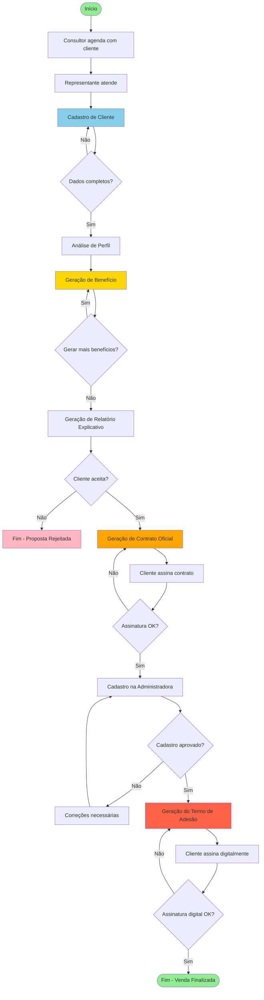
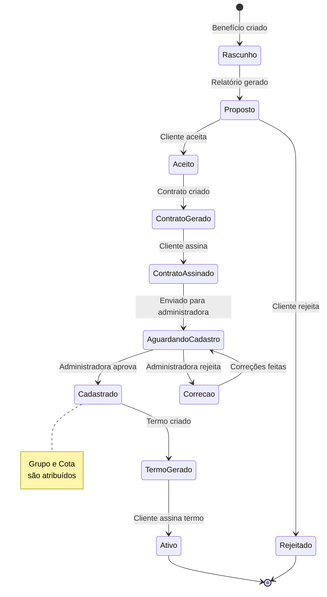
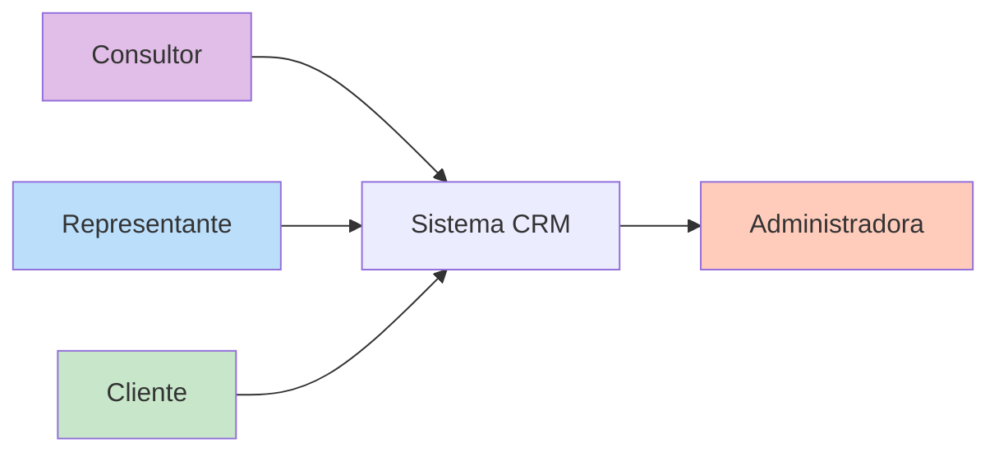
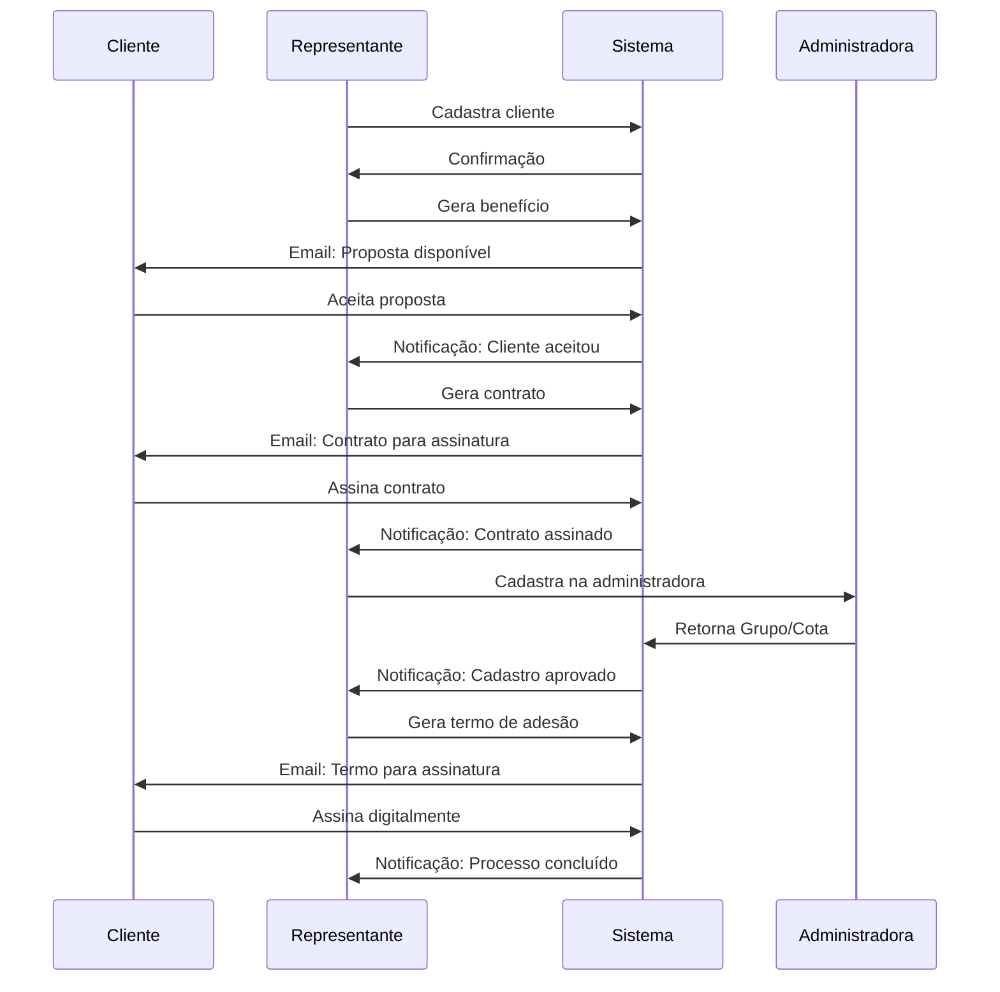

# Fluxo do Sistema CRM - Gestão de Consórcios

## Diagrama de Fluxo Completo

## Fluxo Detalhado por Etapas

### 1️⃣ AGENDAMENTO
**Responsável:** Consultor
- Consultor realiza agendamento com o cliente
- Define data e hora do atendimento
- Registra informações preliminares

### 2️⃣ ATENDIMENTO INICIAL
**Responsável:** Representante
- Representante recebe o cliente agendado
- Inicia processo de cadastro
- Coleta informações básicas

### 3️⃣ CADASTRO DO CLIENTE
**Responsável:** Representante
**Seções do cadastro:**
- Dados Básicos (CPF, RG, Nome, etc.)
- Compromissos Financeiros
- Dados Profissionais
- Preferências do Cliente
- Observações
- Dados Bancários

### 4️⃣ ANÁLISE DE PERFIL
**Sistema:** Automático
- Análise de capacidade financeira
- Cálculo de score baseado em compromissos
- Definição de limite de crédito disponível

### 5️⃣ GERAÇÃO DE BENEFÍCIO(S)
**Responsável:** Representante
**Sistema:** Consulta tabelas pré-definidas
- Pode gerar múltiplos benefícios para o cliente
- Cada benefício baseado em:
  - Prazo do Grupo (tabela)
  - Valor do Crédito (tabela)
  - Parcela (tabela)
  - Fundo de Reserva (tabela)
  - Preferências do cliente

### 6️⃣ RELATÓRIO EXPLICATIVO
**Sistema:** Geração automática
**Formato:** PDF
- Apresenta benefícios gerados
- Explica condições de pagamento
- Mostra simulações
- Documento para apresentação ao cliente

### 7️⃣ ANÁLISE DO CLIENTE
**Responsável:** Cliente
- Cliente analisa relatório
- Decide se aceita ou rejeita
- Pode solicitar ajustes

### 8️⃣ GERAÇÃO DE CONTRATO OFICIAL
**Sistema:** Automático (após aceite)
**Formato:** PDF formal
- Contrato vinculante
- Termos e condições completos
- Todas as cláusulas legais

### 9️⃣ ASSINATURA DO CONTRATO
**Responsável:** Cliente
**Tipo:** Assinatura física ou digital
- Cliente assina contrato
- Validação da assinatura
- Contrato passa a ser válido

### 🔟 CADASTRO NA ADMINISTRADORA
**Responsável:** Sistema/Representante
- Envia dados para administradora
- Aguarda aprovação
- Recebe número de Grupo e Cota
- Atualiza benefício com:
  - Grupo
  - Cota

### 1️⃣1️⃣ TERMO DE ADESÃO
**Sistema:** Geração após cadastro aprovado
**Formato:** PDF para assinatura digital
- Documento final de adesão
- Inclui Grupo e Cota
- Todas as condições finais

### 1️⃣2️⃣ ASSINATURA DIGITAL DO TERMO
**Responsável:** Cliente
**Tipo:** Assinatura digital (certificado digital)
- Cliente assina digitalmente
- Validação da assinatura
- Arquivamento seguro

### ✅ FINALIZAÇÃO
**Status:** Venda Concluída
- Cliente oficialmente cadastrado
- Processo completo
- Aguardando primeira assembleia

## Estados do Benefício

## Documentos Gerados no Fluxo

| Etapa | Documento | Tipo | Assinatura |
|-------|-----------|------|------------|
| Cadastro | Ficha Cadastral | PDF | Não |
| Análise | Relatório Explicativo | PDF | Não |
| Aceite | Contrato Oficial | PDF | Sim (física/digital) |
| Cadastro Administradora | Formulário de Cadastro | PDF/XML | Não |
| Finalização | Termo de Adesão | PDF | Sim (digital) |

## Atores do Sistema

### Permissões por Ator

**Consultor:**
- Agendar atendimentos
- Visualizar clientes
- Acompanhar status

**Representante:**
- Cadastrar clientes
- Gerar benefícios
- Gerar relatórios
- Gerar contratos
- Cadastrar na administradora
- Gerar termos de adesão

**Cliente:**
- Visualizar seus dados (portal futuro)
- Assinar documentos
- Acompanhar benefícios

**Administradora:**
- Receber cadastros
- Aprovar/rejeitar
- Fornecer Grupo/Cota

## Notificações no Fluxo

## Regras de Negócio Importantes

### ⚠️ Validações Críticas

1. **CPF único** - Não permitir duplicação
2. **Capacidade de pagamento** - Parcela não pode exceder 30% da renda
3. **Compromissos financeiros** - Soma total não pode ultrapassar 70% da renda
4. **Documentos obrigatórios** - RG, CPF válidos
5. **Dados bancários** - Validar antes de finalizar
6. **Grupo/Cota** - Só recebidos após aprovação da administradora

### 📊 Cálculos Automáticos

1. **Score de crédito** - Baseado em compromissos
2. **Limite disponível** - Renda - compromissos
3. **Parcela sugerida** - Baseado em tabela + preferências
4. **Taxa efetiva** - Taxa Adm (26%) + Seguro (0%) + Fundo de Reserva

### 🔒 Segurança

1. Apenas representante pode cadastrar na administradora
2. Documentos assinados são imutáveis
3. Auditoria completa de todas as ações
4. Backup de todos os documentos gerados

