# Modelo de Dados - Sistema CRM de Consórcios

## Diagrama de Entidade-Relacionamento

```mermaid
erDiagram
    USUARIO ||--o{ CLIENTE : "cadastra"
    UNIDADE ||--o{ CLIENTE : "pertence"
    EMPRESA ||--o{ CLIENTE : "vinculado"
    REPRESENTANTE ||--o{ BENEFICIO : "gerencia"
    CONSULTOR ||--o{ AGENDAMENTO : "agenda"
    
    CLIENTE ||--o{ BENEFICIO : "possui"
    CLIENTE ||--o{ DOCUMENTO : "tem"
    CLIENTE ||--o{ COMPROMISSO_FINANCEIRO : "possui"
    CLIENTE ||--|| DADOS_PROFISSIONAIS : "tem"
    CLIENTE ||--|| DADOS_BANCARIOS : "tem"
    CLIENTE ||--|| PREFERENCIA_CLIENTE : "tem"
    
    BENEFICIO ||--|| CONTRATO : "gera"
    BENEFICIO ||--|| TERMO_ADESAO : "gera"
    BENEFICIO }|--|| TABELA_CREDITO : "baseado"
    
    CONTRATO ||--o{ ASSINATURA : "tem"
    TERMO_ADESAO ||--o{ ASSINATURA : "tem"
    
    BENEFICIO }o--|| ADMINISTRADORA : "cadastrado"
    
    CLIENTE {
        uuid id PK
        string natureza "Física/Jurídica"
        uuid unidade_id FK
        uuid empresa_id FK
        string nome
        string cpf UK
        string identidade
        string orgao_expedidor
        date data_expedicao
        string sexo
        date data_nascimento
        string nacionalidade
        string naturalidade
        string nome_mae
        string nome_pai
        string estado_civil
        string conjuge_nome
        date conjuge_data_nascimento
        string conjuge_cpf
        string telefone
        string endereco
        string email
        text observacoes
        timestamp created_at
        timestamp updated_at
        uuid created_by FK
    }
    
    COMPROMISSO_FINANCEIRO {
        uuid id PK
        uuid cliente_id FK
        string tipo "Consórcio, Empréstimo, etc"
        boolean possui
        int prazo
        decimal valor
        timestamp created_at
        timestamp updated_at
    }
    
    DADOS_PROFISSIONAIS {
        uuid id PK
        uuid cliente_id FK
        string empresa
        string cargo
        decimal salario
        timestamp created_at
        timestamp updated_at
    }
    
    PREFERENCIA_CLIENTE {
        uuid id PK
        uuid cliente_id FK
        decimal parcela_maxima
        decimal valor_carta
        decimal taxa_inicial
        timestamp created_at
        timestamp updated_at
    }
    
    DADOS_BANCARIOS {
        uuid id PK
        uuid cliente_id FK
        string banco
        string chave_pix
        string tipo_conta
        string agencia
        string conta
        timestamp created_at
        timestamp updated_at
    }
    
    BENEFICIO {
        uuid id PK
        uuid cliente_id FK
        uuid representante_id FK
        uuid consultor_id FK
        uuid empresa_id FK
        uuid unidade_id FK
        int prazo_grupo
        decimal valor_credito
        decimal parcela
        string indice_correcao "INCC"
        decimal fundo_reserva
        decimal seguro_prestamista
        decimal taxa_adm_total
        decimal valor_demais_parcelas
        string tipo_bem "Imóvel/Carro/Moto"
        string grupo "Após cadastro"
        string cota "Após cadastro"
        int qtd_participantes
        string tipo_plano "Normal"
        string status
        timestamp created_at
        timestamp updated_at
    }
    
    CONTRATO {
        uuid id PK
        uuid beneficio_id FK
        string numero_contrato
        text conteudo_html
        string path_pdf
        string status
        timestamp data_geracao
        timestamp data_assinatura
        uuid assinado_por FK
    }
    
    TERMO_ADESAO {
        uuid id PK
        uuid beneficio_id FK
        string numero_termo
        text conteudo_html
        string path_pdf
        string status
        timestamp data_geracao
        timestamp data_assinatura_digital
        string hash_assinatura
        uuid assinado_por FK
    }
    
    TABELA_CREDITO {
        uuid id PK
        int prazo_meses
        decimal valor_credito
        decimal parcela_mensal
        decimal fundo_reserva_percentual
        decimal taxa_administracao
        boolean ativo
        timestamp created_at
        timestamp updated_at
    }
    
    ADMINISTRADORA {
        uuid id PK
        string nome
        string cnpj
        string contato
        string api_endpoint
        boolean ativo
    }
    
    DOCUMENTO {
        uuid id PK
        uuid cliente_id FK
        uuid beneficio_id FK
        string tipo "RG/CPF/Comprovante/etc"
        string nome_arquivo
        string path
        string mime_type
        int tamanho_bytes
        timestamp upload_at
        uuid upload_by FK
    }
    
    ASSINATURA {
        uuid id PK
        uuid contrato_id FK
        uuid termo_adesao_id FK
        uuid usuario_id FK
        string tipo "Física/Digital"
        string hash_documento
        string certificado_digital
        timestamp data_assinatura
        string ip_assinatura
        string localizacao
    }
    
    UNIDADE {
        uuid id PK
        string nome
        string cnpj
        string endereco
        string telefone
        boolean ativo
    }
    
    EMPRESA {
        uuid id PK
        string nome
        string cnpj
        string razao_social
        boolean ativo
    }
    
    REPRESENTANTE {
        uuid id PK
        uuid usuario_id FK
        string nome
        string cpf
        string telefone
        string email
        uuid unidade_id FK
        boolean ativo
    }
    
    CONSULTOR {
        uuid id PK
        uuid usuario_id FK
        string nome
        string cpf
        string telefone
        string email
        boolean ativo
    }
    
    AGENDAMENTO {
        uuid id PK
        uuid consultor_id FK
        uuid representante_id FK
        string nome_cliente
        string telefone_cliente
        datetime data_hora
        string status
        text observacoes
        timestamp created_at
    }
    
    USUARIO {
        uuid id PK
        string nome
        string email UK
        string senha_hash
        string perfil "Admin/Gerente/Representante/Consultor"
        boolean ativo
        timestamp last_login
        timestamp created_at
        timestamp updated_at
    }
```



## Estrutura das Tabelas Principais

### 📋 CLIENTE (Tabela Central)

```sql
CREATE TABLE clientes (
    id UUID PRIMARY KEY DEFAULT gen_random_uuid(),
    
    -- Dados Básicos
    natureza VARCHAR(20) NOT NULL CHECK (natureza IN ('Física', 'Jurídica')),
    unidade_id UUID NOT NULL REFERENCES unidades(id),
    empresa_id UUID REFERENCES empresas(id),
    nome VARCHAR(255) NOT NULL,
    cpf VARCHAR(14) NOT NULL UNIQUE,
    identidade VARCHAR(50),
    orgao_expedidor VARCHAR(50),
    data_expedicao DATE,
    sexo VARCHAR(20) CHECK (sexo IN ('Feminino', 'Masculino', 'Outro')),
    data_nascimento DATE NOT NULL,
    nacionalidade VARCHAR(100),
    naturalidade VARCHAR(100),
    nome_mae VARCHAR(255),
    nome_pai VARCHAR(255),
    estado_civil VARCHAR(50) CHECK (estado_civil IN ('Solteiro', 'Casado', 'União Estável', 'Separado', 'Divorciado', 'Viúvo')),
    
    -- Dados do Cônjuge
    conjuge_nome VARCHAR(255),
    conjuge_data_nascimento DATE,
    conjuge_cpf VARCHAR(14),
    
    -- Contato
    telefone VARCHAR(20) NOT NULL,
    endereco TEXT,
    email VARCHAR(255),
    
    -- Observações
    observacoes TEXT,
    
    -- Auditoria
    created_at TIMESTAMP DEFAULT CURRENT_TIMESTAMP,
    updated_at TIMESTAMP DEFAULT CURRENT_TIMESTAMP,
    created_by UUID REFERENCES usuarios(id),
    deleted_at TIMESTAMP NULL,
    
    -- Índices
    CONSTRAINT cpf_valido CHECK (length(cpf) = 14)
);

CREATE INDEX idx_clientes_cpf ON clientes(cpf);
CREATE INDEX idx_clientes_nome ON clientes(nome);
CREATE INDEX idx_clientes_unidade ON clientes(unidade_id);
CREATE INDEX idx_clientes_created_at ON clientes(created_at);
```

### 💰 COMPROMISSOS_FINANCEIROS

```sql
CREATE TABLE compromissos_financeiros (
    id UUID PRIMARY KEY DEFAULT gen_random_uuid(),
    cliente_id UUID NOT NULL REFERENCES clientes(id) ON DELETE CASCADE,
    
    tipo VARCHAR(100) NOT NULL CHECK (tipo IN (
        'Consórcio',
        'Empréstimo Contracheque',
        'Empréstimo/Leasing/CDC/Crediário',
        'Financiamento Estudantil',
        'Financiamento Veicular',
        'Financiamento Habitacional',
        'Aluguel',
        'Outras Dívidas'
    )),
    
    possui BOOLEAN NOT NULL DEFAULT FALSE,
    prazo INT,
    valor DECIMAL(12,2),
    
    created_at TIMESTAMP DEFAULT CURRENT_TIMESTAMP,
    updated_at TIMESTAMP DEFAULT CURRENT_TIMESTAMP,
    
    UNIQUE(cliente_id, tipo)
);

-- Campos adicionais do cliente
CREATE TABLE clientes_info_credito (
    id UUID PRIMARY KEY DEFAULT gen_random_uuid(),
    cliente_id UUID NOT NULL REFERENCES clientes(id) ON DELETE CASCADE UNIQUE,
    
    possui_restricao BOOLEAN DEFAULT FALSE,
    tentou_credito_12_meses BOOLEAN DEFAULT FALSE,
    
    created_at TIMESTAMP DEFAULT CURRENT_TIMESTAMP,
    updated_at TIMESTAMP DEFAULT CURRENT_TIMESTAMP
);
```

### 💼 DADOS_PROFISSIONAIS

```sql
CREATE TABLE dados_profissionais (
    id UUID PRIMARY KEY DEFAULT gen_random_uuid(),
    cliente_id UUID NOT NULL REFERENCES clientes(id) ON DELETE CASCADE UNIQUE,
    
    empresa VARCHAR(255),
    cargo VARCHAR(255),
    salario DECIMAL(12,2),
    
    created_at TIMESTAMP DEFAULT CURRENT_TIMESTAMP,
    updated_at TIMESTAMP DEFAULT CURRENT_TIMESTAMP
);
```

### 🎯 PREFERENCIAS_CLIENTE

```sql
CREATE TABLE preferencias_cliente (
    id UUID PRIMARY KEY DEFAULT gen_random_uuid(),
    cliente_id UUID NOT NULL REFERENCES clientes(id) ON DELETE CASCADE UNIQUE,
    
    parcela_maxima DECIMAL(12,2),
    valor_carta DECIMAL(12,2),
    taxa_inicial DECIMAL(5,2),
    
    created_at TIMESTAMP DEFAULT CURRENT_TIMESTAMP,
    updated_at TIMESTAMP DEFAULT CURRENT_TIMESTAMP
);
```

### 🏦 DADOS_BANCARIOS

```sql
CREATE TABLE dados_bancarios (
    id UUID PRIMARY KEY DEFAULT gen_random_uuid(),
    cliente_id UUID NOT NULL REFERENCES clientes(id) ON DELETE CASCADE UNIQUE,
    
    banco VARCHAR(100),
    chave_pix VARCHAR(255),
    tipo_conta VARCHAR(50) CHECK (tipo_conta IN ('Corrente', 'Poupança', 'Salário')),
    agencia VARCHAR(10),
    conta VARCHAR(20),
    
    created_at TIMESTAMP DEFAULT CURRENT_TIMESTAMP,
    updated_at TIMESTAMP DEFAULT CURRENT_TIMESTAMP
);
```

### 🎁 BENEFICIOS

```sql
CREATE TABLE beneficios (
    id UUID PRIMARY KEY DEFAULT gen_random_uuid(),
    
    -- Relacionamentos
    cliente_id UUID NOT NULL REFERENCES clientes(id),
    representante_id UUID NOT NULL REFERENCES representantes(id),
    consultor_id UUID REFERENCES consultores(id),
    empresa_id UUID REFERENCES empresas(id),
    unidade_id UUID NOT NULL REFERENCES unidades(id),
    
    -- Dados do Benefício
    prazo_grupo INT NOT NULL,
    valor_credito DECIMAL(12,2) NOT NULL,
    parcela DECIMAL(12,2) NOT NULL,
    indice_correcao VARCHAR(10) DEFAULT 'INCC',
    fundo_reserva DECIMAL(12,2) NOT NULL,
    seguro_prestamista DECIMAL(5,2) DEFAULT 0.00,
    taxa_adm_total DECIMAL(5,2) DEFAULT 26.00,
    valor_demais_parcelas DECIMAL(12,2),
    
    tipo_bem VARCHAR(50) NOT NULL CHECK (tipo_bem IN ('Imóvel', 'Carro', 'Moto')),
    
    -- Dados após cadastro na administradora
    grupo VARCHAR(50),
    cota VARCHAR(50),
    
    qtd_participantes INT DEFAULT 4076,
    tipo_plano VARCHAR(50) DEFAULT 'Normal',
    
    -- Status do benefício
    status VARCHAR(50) NOT NULL DEFAULT 'Rascunho' CHECK (status IN (
        'Rascunho',
        'Proposto',
        'Aceito',
        'Rejeitado',
        'Contrato Gerado',
        'Contrato Assinado',
        'Aguardando Cadastro',
        'Cadastrado',
        'Termo Gerado',
        'Ativo',
        'Cancelado'
    )),
    
    -- Auditoria
    created_at TIMESTAMP DEFAULT CURRENT_TIMESTAMP,
    updated_at TIMESTAMP DEFAULT CURRENT_TIMESTAMP,
    
    CONSTRAINT grupo_cota_juntos CHECK (
        (grupo IS NULL AND cota IS NULL) OR 
        (grupo IS NOT NULL AND cota IS NOT NULL)
    )
);

CREATE INDEX idx_beneficios_cliente ON beneficios(cliente_id);
CREATE INDEX idx_beneficios_status ON beneficios(status);
CREATE INDEX idx_beneficios_representante ON beneficios(representante_id);
```

### 📊 TABELA_CREDITO (Tabelas pré-definidas)

```sql
CREATE TABLE tabela_credito (
    id UUID PRIMARY KEY DEFAULT gen_random_uuid(),
    
    prazo_meses INT NOT NULL,
    valor_credito DECIMAL(12,2) NOT NULL,
    parcela_mensal DECIMAL(12,2) NOT NULL,
    fundo_reserva_percentual DECIMAL(5,2) NOT NULL,
    taxa_administracao DECIMAL(5,2) DEFAULT 26.00,
    tipo_bem VARCHAR(50) CHECK (tipo_bem IN ('Imóvel', 'Carro', 'Moto')),
    
    ativo BOOLEAN DEFAULT TRUE,
    
    created_at TIMESTAMP DEFAULT CURRENT_TIMESTAMP,
    updated_at TIMESTAMP DEFAULT CURRENT_TIMESTAMP,
    
    UNIQUE(prazo_meses, valor_credito, tipo_bem)
);

-- Exemplo de dados
INSERT INTO tabela_credito (prazo_meses, valor_credito, parcela_mensal, fundo_reserva_percentual, tipo_bem) VALUES
(120, 50000.00, 450.00, 2.5, 'Imóvel'),
(120, 100000.00, 900.00, 2.5, 'Imóvel'),
(120, 200000.00, 1800.00, 2.5, 'Imóvel'),
(80, 30000.00, 400.00, 3.0, 'Carro'),
(80, 50000.00, 650.00, 3.0, 'Carro'),
(60, 15000.00, 280.00, 3.5, 'Moto');
```

### 📄 CONTRATOS

```sql
CREATE TABLE contratos (
    id UUID PRIMARY KEY DEFAULT gen_random_uuid(),
    beneficio_id UUID NOT NULL REFERENCES beneficios(id) UNIQUE,
    
    numero_contrato VARCHAR(50) NOT NULL UNIQUE,
    conteudo_html TEXT NOT NULL,
    path_pdf VARCHAR(500),
    
    status VARCHAR(50) NOT NULL DEFAULT 'Gerado' CHECK (status IN (
        'Gerado',
        'Enviado',
        'Assinado',
        'Cancelado'
    )),
    
    data_geracao TIMESTAMP DEFAULT CURRENT_TIMESTAMP,
    data_assinatura TIMESTAMP,
    assinado_por UUID REFERENCES usuarios(id),
    
    created_at TIMESTAMP DEFAULT CURRENT_TIMESTAMP,
    updated_at TIMESTAMP DEFAULT CURRENT_TIMESTAMP
);

CREATE INDEX idx_contratos_beneficio ON contratos(beneficio_id);
CREATE INDEX idx_contratos_status ON contratos(status);
```

### 📝 TERMOS_ADESAO

```sql
CREATE TABLE termos_adesao (
    id UUID PRIMARY KEY DEFAULT gen_random_uuid(),
    beneficio_id UUID NOT NULL REFERENCES beneficios(id) UNIQUE,
    
    numero_termo VARCHAR(50) NOT NULL UNIQUE,
    conteudo_html TEXT NOT NULL,
    path_pdf VARCHAR(500),
    
    status VARCHAR(50) NOT NULL DEFAULT 'Gerado' CHECK (status IN (
        'Gerado',
        'Enviado',
        'Assinado',
        'Cancelado'
    )),
    
    data_geracao TIMESTAMP DEFAULT CURRENT_TIMESTAMP,
    data_assinatura_digital TIMESTAMP,
    hash_assinatura VARCHAR(255),
    assinado_por UUID REFERENCES usuarios(id),
    
    created_at TIMESTAMP DEFAULT CURRENT_TIMESTAMP,
    updated_at TIMESTAMP DEFAULT CURRENT_TIMESTAMP
);

CREATE INDEX idx_termos_beneficio ON termos_adesao(beneficio_id);
CREATE INDEX idx_termos_status ON termos_adesao(status);
```

### ✍️ ASSINATURAS

```sql
CREATE TABLE assinaturas (
    id UUID PRIMARY KEY DEFAULT gen_random_uuid(),
    
    contrato_id UUID REFERENCES contratos(id),
    termo_adesao_id UUID REFERENCES termos_adesao(id),
    usuario_id UUID NOT NULL REFERENCES usuarios(id),
    
    tipo VARCHAR(20) NOT NULL CHECK (tipo IN ('Física', 'Digital')),
    hash_documento VARCHAR(255) NOT NULL,
    certificado_digital TEXT,
    
    data_assinatura TIMESTAMP DEFAULT CURRENT_TIMESTAMP,
    ip_assinatura VARCHAR(50),
    localizacao VARCHAR(255),
    
    CONSTRAINT assinatura_ou_contrato_ou_termo CHECK (
        (contrato_id IS NOT NULL AND termo_adesao_id IS NULL) OR
        (contrato_id IS NULL AND termo_adesao_id IS NOT NULL)
    )
);
```

### 🏢 ADMINISTRADORAS

```sql
CREATE TABLE administradoras (
    id UUID PRIMARY KEY DEFAULT gen_random_uuid(),
    
    nome VARCHAR(255) NOT NULL,
    cnpj VARCHAR(18) NOT NULL UNIQUE,
    contato VARCHAR(100),
    email VARCHAR(255),
    telefone VARCHAR(20),
    api_endpoint VARCHAR(500),
    api_key VARCHAR(255),
    
    ativo BOOLEAN DEFAULT TRUE,
    
    created_at TIMESTAMP DEFAULT CURRENT_TIMESTAMP,
    updated_at TIMESTAMP DEFAULT CURRENT_TIMESTAMP
);

-- Relacionamento benefício com administradora
ALTER TABLE beneficios ADD COLUMN administradora_id UUID REFERENCES administradoras(id);
ALTER TABLE beneficios ADD COLUMN data_cadastro_administradora TIMESTAMP;
```

## Views Úteis

### View: Resumo do Cliente

```sql
CREATE VIEW vw_cliente_completo AS
SELECT 
    c.id,
    c.nome,
    c.cpf,
    c.telefone,
    c.email,
    dp.salario,
    dp.empresa as empresa_trabalho,
    COUNT(DISTINCT cf.id) FILTER (WHERE cf.possui = TRUE) as qtd_compromissos,
    SUM(cf.valor) FILTER (WHERE cf.possui = TRUE) as total_compromissos,
    pc.parcela_maxima,
    pc.valor_carta,
    COUNT(DISTINCT b.id) as qtd_beneficios,
    COUNT(DISTINCT b.id) FILTER (WHERE b.status = 'Ativo') as beneficios_ativos
FROM clientes c
LEFT JOIN dados_profissionais dp ON c.id = dp.cliente_id
LEFT JOIN compromissos_financeiros cf ON c.id = cf.cliente_id
LEFT JOIN preferencias_cliente pc ON c.id = pc.cliente_id
LEFT JOIN beneficios b ON c.id = b.cliente_id
WHERE c.deleted_at IS NULL
GROUP BY c.id, c.nome, c.cpf, c.telefone, c.email, 
         dp.salario, dp.empresa, pc.parcela_maxima, pc.valor_carta;
```

### View: Pipeline de Vendas

```sql
CREATE VIEW vw_pipeline_vendas AS
SELECT 
    b.status,
    COUNT(*) as quantidade,
    SUM(b.valor_credito) as valor_total,
    AVG(b.valor_credito) as valor_medio
FROM beneficios b
GROUP BY b.status
ORDER BY 
    CASE b.status
        WHEN 'Rascunho' THEN 1
        WHEN 'Proposto' THEN 2
        WHEN 'Aceito' THEN 3
        WHEN 'Contrato Gerado' THEN 4
        WHEN 'Contrato Assinado' THEN 5
        WHEN 'Aguardando Cadastro' THEN 6
        WHEN 'Cadastrado' THEN 7
        WHEN 'Termo Gerado' THEN 8
        WHEN 'Ativo' THEN 9
        ELSE 10
    END;
```

## Triggers Importantes

### Trigger: Atualizar updated_at

```sql
CREATE OR REPLACE FUNCTION update_updated_at_column()
RETURNS TRIGGER AS $$
BEGIN
    NEW.updated_at = CURRENT_TIMESTAMP;
    RETURN NEW;
END;
$$ LANGUAGE plpgsql;

-- Aplicar em todas as tabelas
CREATE TRIGGER update_clientes_updated_at
    BEFORE UPDATE ON clientes
    FOR EACH ROW
    EXECUTE FUNCTION update_updated_at_column();

CREATE TRIGGER update_beneficios_updated_at
    BEFORE UPDATE ON beneficios
    FOR EACH ROW
    EXECUTE FUNCTION update_updated_at_column();

-- Repetir para outras tabelas...
```

### Trigger: Auditoria de Mudanças

```sql
CREATE TABLE auditoria (
    id UUID PRIMARY KEY DEFAULT gen_random_uuid(),
    tabela VARCHAR(100) NOT NULL,
    operacao VARCHAR(10) NOT NULL,
    registro_id UUID NOT NULL,
    dados_antigos JSONB,
    dados_novos JSONB,
    usuario_id UUID REFERENCES usuarios(id),
    timestamp TIMESTAMP DEFAULT CURRENT_TIMESTAMP
);

CREATE OR REPLACE FUNCTION audit_trigger()
RETURNS TRIGGER AS $$
BEGIN
    IF TG_OP = 'UPDATE' THEN
        INSERT INTO auditoria (tabela, operacao, registro_id, dados_antigos, dados_novos, usuario_id)
        VALUES (TG_TABLE_NAME, 'UPDATE', OLD.id, row_to_json(OLD), row_to_json(NEW), current_setting('app.user_id', true)::UUID);
    ELSIF TG_OP = 'DELETE' THEN
        INSERT INTO auditoria (tabela, operacao, registro_id, dados_antigos, usuario_id)
        VALUES (TG_TABLE_NAME, 'DELETE', OLD.id, row_to_json(OLD), current_setting('app.user_id', true)::UUID);
    END IF;
    RETURN NEW;
END;
$$ LANGUAGE plpgsql;

-- Aplicar em tabelas críticas
CREATE TRIGGER audit_beneficios
    AFTER UPDATE OR DELETE ON beneficios
    FOR EACH ROW
    EXECUTE FUNCTION audit_trigger();
```

